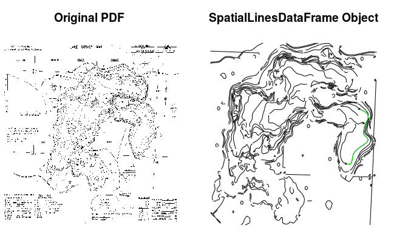
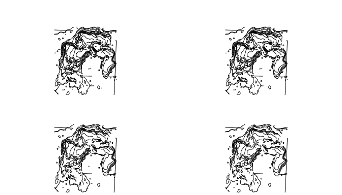

<!-- README.md is generated from README.Rmd. Please edit that file -->

# contour2bathy

Convert a pdf with contour lines to a bathymetric (raster) map loosely
following
<https://gis.stackexchange.com/questions/93103/connecting-grass-with-r?rq=1>

## Installation

You can install contour2bathy from github with:

``` r
# install.packages("devtools")
devtools::install_github("jsta/contour2bathy")
```

## [Potential Tools and Workflow](https://grasswiki.osgeo.org/wiki/Trace_vector_contours_from_a_scanned_map)

  - GRASS

  - R

## Usage

``` r
 library(contour2bathy)
 pdf <- system.file("extdata/1835300a.pdf", package = "contour2bathy")
 res <- contour_read(pdf_path = pdf)
 par(mfrow = c(1,2))
 par(mar = c(0,0,3,0))
 
 sp::plot(res$raster, 
          col = "black", axes = FALSE, box = FALSE, 
          legend = FALSE, main = "Original PDF")
 sp::plot(res$lines, main = "SpatialLinesDataFrame Object")
 
 class(res$lines)
 
 longest_line <- res$lines[which.max(sp::SpatialLinesLengths(res$lines)),]
 sp::plot(longest_line, add = TRUE, col = "green")
```

<!-- -->

### Sensitivity to smallest\_length threshold

``` r
par(mfrow = c(2,2))
par(mar = c(0,0,3,0))
sapply(c(0.007, 0.01, 0.015, 0.02), 
       function(x) sp::plot(contour_read(pdf_path = pdf, 
                                         smallest_length = x)$lines))
```

<!-- -->

## References

<https://grass.osgeo.org/grass73/manuals/>

<https://grasswiki.osgeo.org/wiki/R_statistics/rgrass7>
