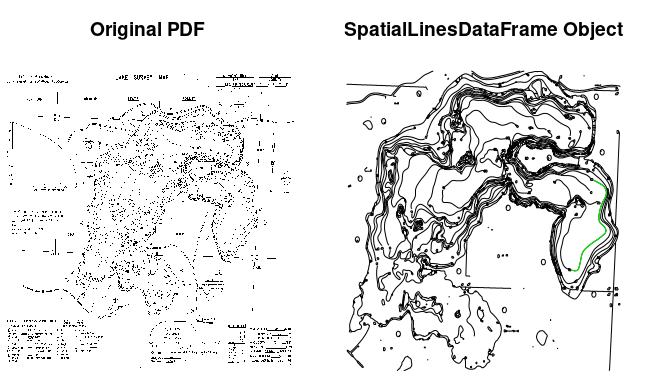

<!-- README.md is generated from README.Rmd. Please edit that file -->
contour2bathy
=============

Convert a pdf with contour lines to a bathymetric (raster) map loosely following <https://gis.stackexchange.com/questions/93103/connecting-grass-with-r?rq=1>

Installation
------------

You can install contour2bathy from github with:

``` r
# install.packages("devtools")
devtools::install_github("jsta/contour2bathy")
```

[Potential Tools and Workflow](https://grasswiki.osgeo.org/wiki/Trace_vector_contours_from_a_scanned_map)
---------------------------------------------------------------------------------------------------------

-   Inkscape?

-   GRASS

-   R

Usage
-----

``` r
 library(contour2bathy)
 pdf <- system.file("extdata/1835300a.pdf", package = "contour2bathy")
 res <- contour_read(pdf_path = pdf)
 par(mfrow = c(1,1))
 sp::plot(res)
```



References
----------

<https://grass.osgeo.org/grass73/manuals/>

<https://grasswiki.osgeo.org/wiki/R_statistics/rgrass7>
